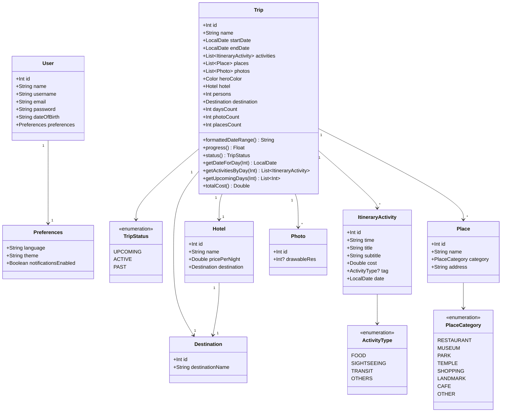
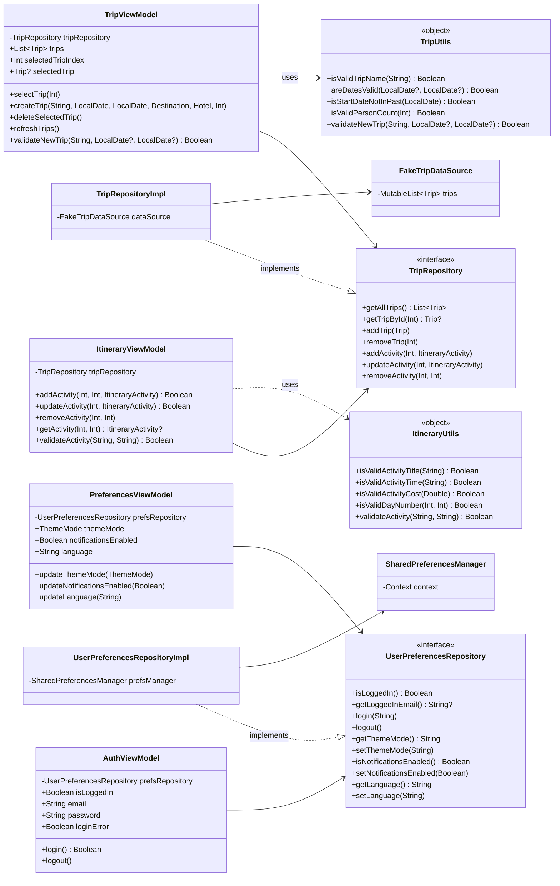

# Data Model

## Domain Model

```mermaid
classDiagram
    direction TB

    class User {
        +Int id
        +String name
        +String username
        +String email
        +String password
        +String dateOfBirth
        +Preferences preferences
    }

    class Preferences {
        +String language
        +String theme
        +Boolean notificationsEnabled
    }

    class Trip {
        +Int id
        +String name
        +LocalDate startDate
        +LocalDate endDate
        +List~ItineraryActivity~ activities
        +List~Place~ places
        +List~Photo~ photos
        +Color heroColor
        +Hotel hotel
        +Int persons
        +Destination destination
        +Int daysCount
        +Int photoCount
        +Int placesCount
        +formattedDateRange() String
        +progress() Float
        +status() TripStatus
        +getDateForDay(Int) LocalDate
        +getActivitiesByDay(Int) List~ItineraryActivity~
        +getUpcomingDays(Int) List~Int~
        +totalCost() Double
    }

    class TripStatus {
        <<enumeration>>
        UPCOMING
        ACTIVE
        PAST
    }

    class Destination {
        +Int id
        +String destinationName
    }

    class Hotel {
        +Int id
        +String name
        +Double pricePerNight
        +Destination destination
    }

    class ItineraryActivity {
        +Int id
        +String time
        +String title
        +String subtitle
        +Double cost
        +ActivityType? tag
        +LocalDate date
    }

    class ActivityType {
        <<enumeration>>
        FOOD
        SIGHTSEEING
        TRANSIT
        OTHERS
    }

    class Photo {
        +Int id
        +Int? drawableRes
    }

    class Place {
        +Int id
        +String name
        +PlaceCategory category
        +String address
    }

    class PlaceCategory {
        <<enumeration>>
        RESTAURANT
        MUSEUM
        PARK
        TEMPLE
        SHOPPING
        LANDMARK
        CAFE
        OTHER
    }

    User "1" --> "1" Preferences

    Trip "1" --> "1" Destination
    Trip "1" --> "1" Hotel
    Trip "1" --> "*" ItineraryActivity
    Trip "1" --> "*" Photo
    Trip "1" --> "*" Place
    Trip --> TripStatus

    Hotel "1" --> "1" Destination

    ItineraryActivity --> ActivityType

    Place --> PlaceCategory
```

## Architecture (MVVM + Hilt)

```mermaid
classDiagram
    direction LR

    class TripViewModel {
        -TripRepository tripRepository
        +List~Trip~ trips
        +Int selectedTripIndex
        +Trip? selectedTrip
        +selectTrip(Int)
        +createTrip(String, LocalDate, LocalDate, Destination, Hotel, Int)
        +deleteSelectedTrip()
        +refreshTrips()
        +validateNewTrip(String, LocalDate?, LocalDate?) Boolean
    }

    class ItineraryViewModel {
        -TripRepository tripRepository
        +addActivity(Int, Int, ItineraryActivity) Boolean
        +updateActivity(Int, ItineraryActivity) Boolean
        +removeActivity(Int, Int)
        +getActivity(Int, Int) ItineraryActivity?
        +validateActivity(String, String) Boolean
    }

    class AuthViewModel {
        -UserPreferencesRepository prefsRepository
        +Boolean isLoggedIn
        +String email
        +String password
        +Boolean loginError
        +login() Boolean
        +logout()
    }

    class PreferencesViewModel {
        -UserPreferencesRepository prefsRepository
        +ThemeMode themeMode
        +Boolean notificationsEnabled
        +String language
        +updateThemeMode(ThemeMode)
        +updateNotificationsEnabled(Boolean)
        +updateLanguage(String)
    }

    class TripRepository {
        <<interface>>
        +getAllTrips() List~Trip~
        +getTripById(Int) Trip?
        +addTrip(Trip)
        +removeTrip(Int)
        +addActivity(Int, ItineraryActivity)
        +updateActivity(Int, ItineraryActivity)
        +removeActivity(Int, Int)
    }

    class UserPreferencesRepository {
        <<interface>>
        +isLoggedIn() Boolean
        +getLoggedInEmail() String?
        +login(String)
        +logout()
        +getThemeMode() String
        +setThemeMode(String)
        +isNotificationsEnabled() Boolean
        +setNotificationsEnabled(Boolean)
        +getLanguage() String
        +setLanguage(String)
    }

    class TripRepositoryImpl {
        -FakeTripDataSource dataSource
    }

    class UserPreferencesRepositoryImpl {
        -SharedPreferencesManager prefsManager
    }

    class FakeTripDataSource {
        -MutableList~Trip~ trips
    }

    class SharedPreferencesManager {
        -Context context
    }

    class TripUtils {
        <<object>>
        +isValidTripName(String) Boolean
        +areDatesValid(LocalDate?, LocalDate?) Boolean
        +isStartDateNotInPast(LocalDate) Boolean
        +isValidPersonCount(Int) Boolean
        +validateNewTrip(String, LocalDate?, LocalDate?) Boolean
    }

    class ItineraryUtils {
        <<object>>
        +isValidActivityTitle(String) Boolean
        +isValidActivityTime(String) Boolean
        +isValidActivityCost(Double) Boolean
        +isValidDayNumber(Int, Int) Boolean
        +validateActivity(String, String) Boolean
    }

    TripViewModel --> TripRepository
    TripViewModel ..> TripUtils : uses
    ItineraryViewModel --> TripRepository
    ItineraryViewModel ..> ItineraryUtils : uses
    AuthViewModel --> UserPreferencesRepository
    PreferencesViewModel --> UserPreferencesRepository

    TripRepositoryImpl ..|> TripRepository : implements
    UserPreferencesRepositoryImpl ..|> UserPreferencesRepository : implements

    TripRepositoryImpl --> FakeTripDataSource
    UserPreferencesRepositoryImpl --> SharedPreferencesManager
```
