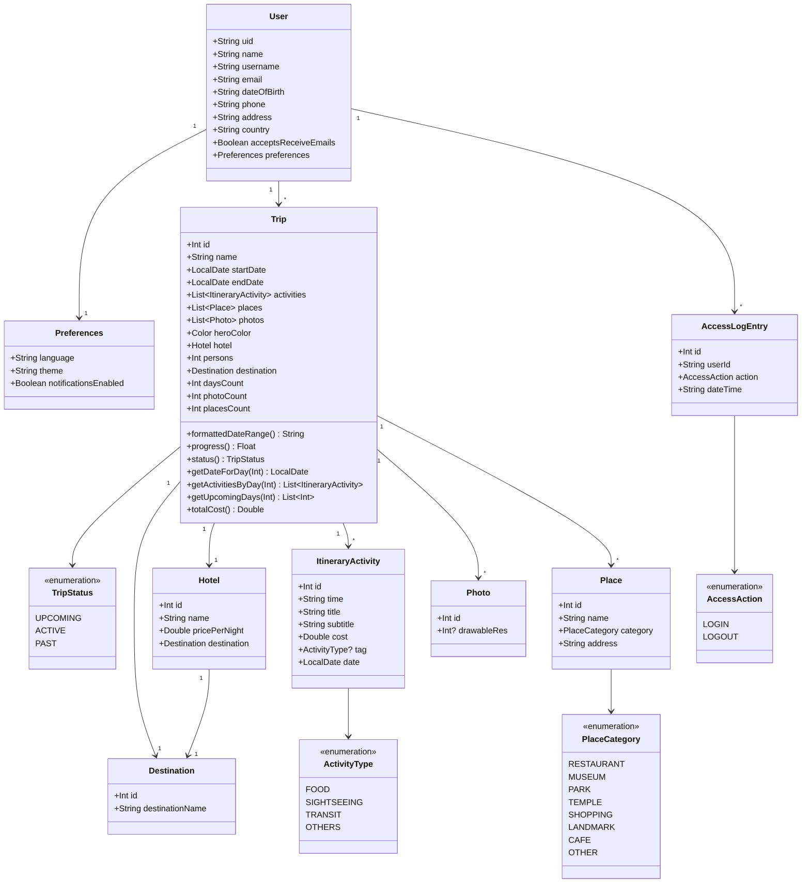

# Data Model

```mermaid
classDiagram
    direction TB

    class User {
        +String uid
        +String name
        +String username
        +String email
        +String dateOfBirth
        +String phone
        +String address
        +String country
        +Boolean acceptsReceiveEmails
        +Preferences preferences
    }

    class Preferences {
        +String language
        +String theme
        +Boolean notificationsEnabled
    }

    class Trip {
        +Int id
        +String name
        +LocalDate startDate
        +LocalDate endDate
        +List~ItineraryActivity~ activities
        +List~Place~ places
        +List~Photo~ photos
        +Color heroColor
        +Hotel hotel
        +Int persons
        +Destination destination
        +Int daysCount
        +Int photoCount
        +Int placesCount
        +formattedDateRange() String
        +progress() Float
        +status() TripStatus
        +getDateForDay(Int) LocalDate
        +getActivitiesByDay(Int) List~ItineraryActivity~
        +getUpcomingDays(Int) List~Int~
        +totalCost() Double
    }

    class TripStatus {
        <<enumeration>>
        UPCOMING
        ACTIVE
        PAST
    }

    class Destination {
        +Int id
        +String destinationName
    }

    class Hotel {
        +Int id
        +String name
        +Double pricePerNight
        +Destination destination
    }

    class ItineraryActivity {
        +Int id
        +String time
        +String title
        +String subtitle
        +Double cost
        +ActivityType? tag
        +LocalDate date
    }

    class ActivityType {
        <<enumeration>>
        FOOD
        SIGHTSEEING
        TRANSIT
        OTHERS
    }

    class Photo {
        +Int id
        +Int? drawableRes
    }

    class Place {
        +Int id
        +String name
        +PlaceCategory category
        +String address
    }

    class PlaceCategory {
        <<enumeration>>
        RESTAURANT
        MUSEUM
        PARK
        TEMPLE
        SHOPPING
        LANDMARK
        CAFE
        OTHER
    }

    class AccessLogEntry {
        +Int id
        +String userId
        +AccessAction action
        +String dateTime
    }

    class AccessAction {
        <<enumeration>>
        LOGIN
        LOGOUT
    }

    User "1" --> "1" Preferences
    User "1" --> "*" Trip
    User "1" --> "*" AccessLogEntry

    Trip --> TripStatus
    Trip "1" --> "1" Destination
    Trip "1" --> "1" Hotel
    Trip "1" --> "*" ItineraryActivity
    Trip "1" --> "*" Photo
    Trip "1" --> "*" Place

    Hotel "1" --> "1" Destination
    ItineraryActivity --> ActivityType
    Place --> PlaceCategory
    AccessLogEntry --> AccessAction
```
