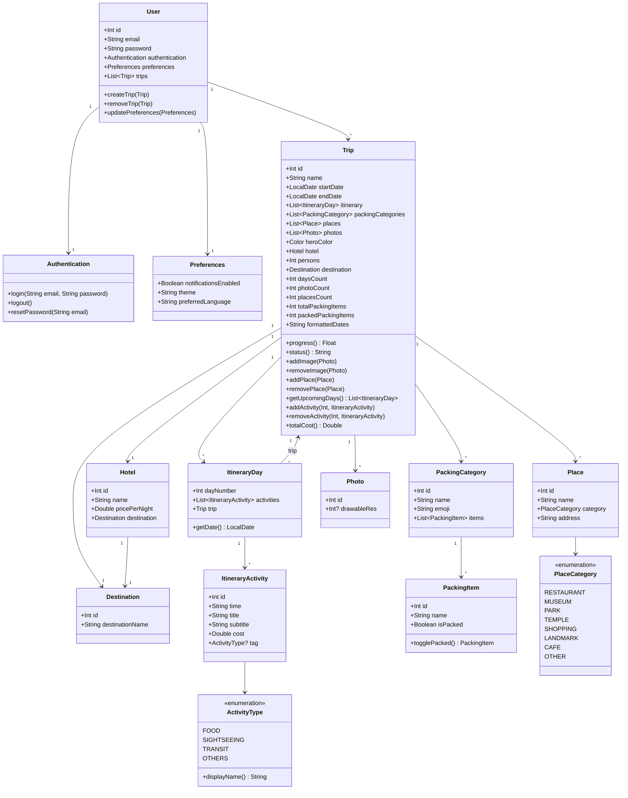

# Data Model

```mermaid
classDiagram
    direction TB

    class User {
        +Int id
        +String email
        +String password
        +Authentication authentication
        +Preferences preferences
        +List~Trip~ trips
        +createTrip(Trip)
        +removeTrip(Trip)
        +updatePreferences(Preferences)
    }

    class Authentication {
        +login(String email, String password)
        +logout()
        +resetPassword(String email)
    }

    class Preferences {
        +Boolean notificationsEnabled
        +String theme
        +String preferredLanguage
    }

    class Trip {
        +Int id
        +String name
        +LocalDate startDate
        +LocalDate endDate
        +List~ItineraryDay~ itinerary
        +List~PackingCategory~ packingCategories
        +List~Place~ places
        +List~Photo~ photos
        +Color heroColor
        +Hotel hotel
        +Int persons
        +Destination destination
        +Int daysCount
        +Int photoCount
        +Int placesCount
        +Int totalPackingItems
        +Int packedPackingItems
        +String formattedDates
        +progress() Float
        +status() String
        +addImage(Photo)
        +removeImage(Photo)
        +addPlace(Place)
        +removePlace(Place)
        +getUpcomingDays() List~ItineraryDay~
        +addActivity(Int, ItineraryActivity)
        +removeActivity(Int, ItineraryActivity)
        +totalCost() Double
    }

    class Destination {
        +Int id
        +String destinationName
    }

    class Hotel {
        +Int id
        +String name
        +Double pricePerNight
        +Destination destination
    }

    class ItineraryDay {
        +Int dayNumber
        +List~ItineraryActivity~ activities
        +Trip trip
        +getDate() LocalDate
    }

    class ItineraryActivity {
        +Int id
        +String time
        +String title
        +String subtitle
        +Double cost
        +ActivityType? tag
    }

    class ActivityType {
        <<enumeration>>
        FOOD
        SIGHTSEEING
        TRANSIT
        OTHERS
        +displayName() String
    }

    class PackingCategory {
        +Int id
        +String name
        +String emoji
        +List~PackingItem~ items
    }

    class PackingItem {
        +Int id
        +String name
        +Boolean isPacked
        +togglePacked() PackingItem
    }

    class Photo {
        +Int id
        +Int? drawableRes
    }

    class Place {
        +Int id
        +String name
        +PlaceCategory category
        +String address
    }

    class PlaceCategory {
        <<enumeration>>
        RESTAURANT
        MUSEUM
        PARK
        TEMPLE
        SHOPPING
        LANDMARK
        CAFE
        OTHER
    }

    User "1" --> "1" Authentication
    User "1" --> "1" Preferences
    User "1" --> "*" Trip

    Trip "1" --> "1" Destination
    Trip "1" --> "1" Hotel
    Trip "1" --> "*" ItineraryDay
    Trip "1" --> "*" PackingCategory
    Trip "1" --> "*" Photo
    Trip "1" --> "*" Place

    Hotel "1" --> "1" Destination

    ItineraryDay "*" --> "1" Trip : trip
    ItineraryDay "1" --> "*" ItineraryActivity

    ItineraryActivity --> ActivityType

    PackingCategory "1" --> "*" PackingItem

    Place --> PlaceCategory
```
