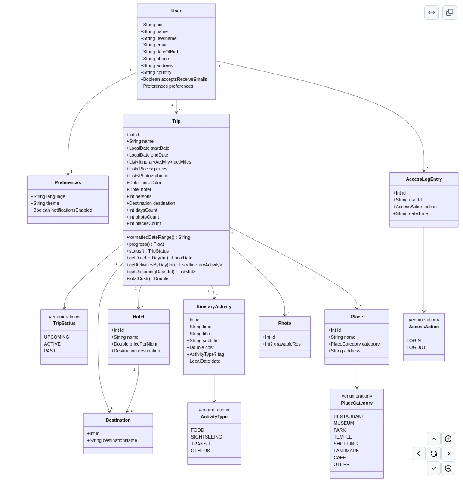

# 📐 Diseño Arquitectónico de Travel Planner

## 🏛️ Arquitectura General
Travel Planner sigue una arquitectura **MVVM (Model-View-ViewModel)** para una mejor separación de responsabilidades y escalabilidad.

## 📊 Modelo de Datos: Creado completo para futuros Sprints

